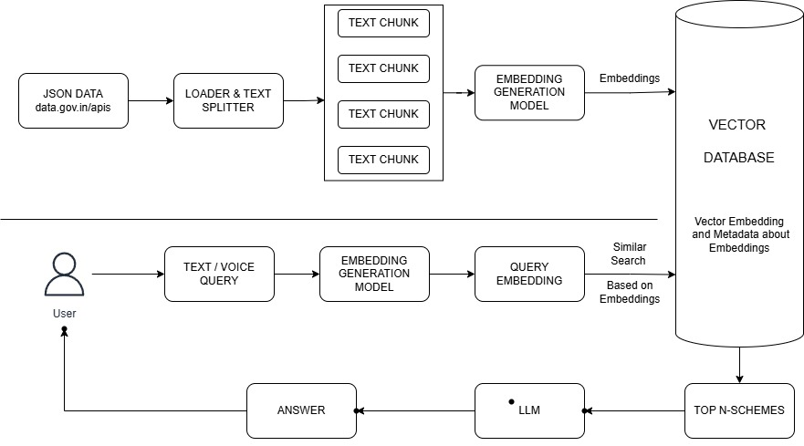

## Samarth AI  
### A Smart Chatbot for Government Scheme Assistance  

  
  

## Team Name  
**Xeno**  

## Problem Statement  
Chatbot for suggesting government schemes and financial aid  

## Project Description  
Samarth AI is an intelligent chatbot that helps users discover relevant government schemes and financial aid programs using **Retrieval-Augmented Generation (RAG)**. The system:

1. Uses **IBM watsonx.ai's IBM_SLATE_30M_ENG** model to generate embeddings of scheme data
2. Stores vectors in **FAISS** for efficient similarity search
3. Retrieves relevant schemes based on user queries (e.g., "Educational support for girls")
4. Generates natural language responses using **Granite-13b-instruct-v2** LLM

## Dataset

This chatbot currently uses a curated dataset of 32 government schemes. The selection was made to demonstrate core functionality within the limited timeframe available for the project submission.

While the dataset size is relatively small, it was carefully designed to cover a variety of scheme types (educational, financial, health, etc.) and to validate the chatbot’s ability to retrieve relevant and context-aware responses.

## Future Improvements

- **Dataset Expansion**: We plan to scale the dataset significantly by incorporating hundreds of additional schemes from official government portals and open data sources.
- **Automated Updates**: Future iterations will include an automated system to fetch and update schemes regularly, ensuring the chatbot remains accurate and up-to-date.
- **Multilingual Support**: The dataset will be extended to support multiple regional languages to increase accessibility.
- **Enhanced Filtering & Recommendations**: More detailed metadata and eligibility fields will be added to improve personalization and intelligent scheme recommendations.

This is an ongoing project, and we are committed to refining the system to better serve its intended users.

## Architecture



## Technologies Used  
| Component          | Technology Stack              |
|--------------------|-------------------------------|
| **Embeddings**     | IBM watsonx.ai (SLATE-30M-ENG)|
| **Vector Store**   | FAISS                         |
| **LLM**           | Granite-13b-instruct-v2       |
| **Backend**       | Flask                         |
| **Frontend**      | React.js                      |
| **Data Storage**  | JSON                          |

## Setup & Installation

### Prerequisites
- Python ≥ 3.8
- Node.js ≥ 16.x
- IBM watsonx.ai API credentials

### Backend Setup
```bash
# Clone repository
git clone https://github.com/SarthakArora7/xeno-Samarth.git

# Install dependencies
pip install -r requirements.txt

# Configure environment
IBM_API_KEY = "YOUR_API_KEY"
PROJECT_ID = "YOUR_PROJECT_ID"
IBM_URL = "YOUR_REGION_IBM_CLOUD_URL"
# Edit .env with your credentials

# Run Flask server
cd backend.py
python app.py

```
### Frontend Setup Guide (Vite + React)
```bash
# Clone repository (if not already done)
git clone https://github.com/SarthakArora7/xeno-Samarth.git
cd frontend
cd chatty

# Install dependencies
npm install
or
npm i

# Run React Server
npm run dev

```
## Video
### Drive Link: https://drive.google.com/file/d/1uFkST2Ywc6lxUA54Woko5gBqQT27306C/view?usp=sharing 
